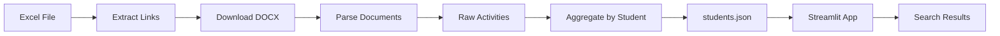

# 🎓 NRL Tracker - Student Activity Tracking System

[](https://www.python.org/downloads/)
[](https://streamlit.io)
[](LICENSE)

> **100% Free** student activity tracking platform - No fees, No registration required!

A modern web application that enables students to look up their extracurricular activity records (NRL - Ngày Rèn Luyện) completely free, eliminating the 10,000 VND/query fee from competitors.

## 🌟 Key Features

- ✨ **100% Free** - Unlimited searches, no payment required
- 🔍 **Smart Search** - Search by Student ID (MSSV) or Name
- ⚡ **Instant Results** - Fast O(1) hash-based lookup
- 📊 **Detailed Analytics** - View all activities and total NRL points
- 🎨 **Modern UI** - Clean, responsive design with animations
- 🔒 **No Login Required** - Privacy-first approach
- 📈 **Search Analytics** - Track usage statistics

## 🏗️ Architecture

```
StudentActivityTracker/
├── app.py                      # Main Streamlit application
├── scripts/
│   └── build_data.py          # Data processing pipeline
├── src/
│   ├── ui/                    # UI components (Component-based)
│   │   ├── styles.css         # Modern CSS with animations
│   │   ├── layout.py          # Header, Hero, Footer
│   │   └── cards.py           # Student card, Activity list
│   ├── extractor.py           # Extract links from Excel
│   ├── downloader.py          # Download documents from Google Drive
│   ├── parser.py              # Parse DOCX files
│   ├── aggregator.py          # Aggregate student data
│   ├── searcher.py            # Smart search engine
│   └── search_logger.py       # Analytics logger
└── data/
    ├── students.json          # Final aggregated data
    ├── raw_activities.json    # Parsed activity records
    └── search_logs.json       # Search history
```

## 🚀 Quick Start

### Prerequisites

- Python 3.9 or higher
- pip (Python package manager)

### Installation

1. **Clone the repository**
```bash
git clone https://github.com/nhien36hk/StudentActivityTracker.git
cd StudentActivityTracker
```

2. **Create virtual environment**
```bash
python -m venv venv
source venv/bin/activate  # On Windows: venv\Scripts\activate
```

3. **Install dependencies**
```bash
pip install -r requirements.txt
```

4. **Process data (Optional - if you have source Excel file)**
```bash
# Process all links
python scripts/build_data.py

# Or test with limited links
python scripts/build_data.py --limit 10
```

5. **Run the application**
```bash
streamlit run app.py
```

The app will be available at `http://localhost:8501`

## 💡 Usage

### For Students

1. Open the web application
2. Enter your **Student ID (MSSV)** or **Name** in the search box
3. Click **"🔍 Tìm kiếm"** button
4. View your:
   - Total NRL points
   - List of all activities participated
   - Links to original documents

### For Administrators

**Data Processing Pipeline:**

```bash
# Full data build
python scripts/build_data.py

# Test with limited files
python scripts/build_data.py --limit 5
```

**Pipeline stages:**
1. **Extract** - Read hyperlinks from Excel file
2. **Download** - Fetch DOCX files from Google Drive
3. **Parse** - Extract student records from documents
4. **Aggregate** - Group by student ID and calculate totals

## 🔧 Technical Highlights

### Smart Search Algorithm

```python
# O(1) lookup for Student ID
if has_digit(query):
    return hash_map[query]

# Fuzzy matching for names (diacritics-insensitive)
else:
    return partial_match(normalize(query))
```

### Component-Based UI Architecture

Following React-like patterns for maintainability:
- **Separation of Concerns**: CSS, Logic, UI Components
- **Reusable Components**: Cards, Layout, Forms
- **Clean Code**: < 100 lines per file

### Data Processing Features

- **Smart ID Detection**: Auto-swap misplaced ID/Class columns
- **Robust Parsing**: Handle malformed tables and missing data
- **Error Handling**: Mark unknown records instead of skipping
- **Validation**: Regex-based ID and class code validation

## 📊 Data Flow



## 🎨 UI/UX Design

- **Modern Color Scheme**: Warm gradient (Red-Yellow)
- **Glassmorphism**: Frosted glass effects
- **Animations**: Float, pulse, slide-up transitions
- **Responsive**: Works on desktop and mobile
- **Accessibility**: Clean typography, high contrast

## 📈 Performance

- **Search Speed**: O(1) for exact match, O(n) for fuzzy search
- **Data Caching**: Streamlit `@st.cache_data` decorator
- **Lazy Loading**: Load data only when needed
- **Optimized Rendering**: Component-based updates

## 🛠️ Technologies Used

| Category | Technology | Version |
|----------|-----------|---------|
| Frontend | Streamlit | 1.52.2 |
| Data Processing | Pandas | 2.3.3 |
| Document Parsing | python-docx | 1.2.0 |
| Excel Reading | openpyxl | 3.1.5 |
| HTTP Client | requests | 2.32.5 |

## 📝 Configuration

No configuration required! The app works out of the box.

Optional: Edit `src/ui/styles.css` to customize colors and themes.

## 🐛 Known Issues & Solutions

### Issue: Input bị che phần dưới
**Solution**: Added `overflow: visible` to all Streamlit containers

### Issue: Logo text bị mất màu
**Solution**: Changed from gradient text to solid color

### Issue: Search box không căn giữa
**Solution**: Target `div[data-testid="stHorizontalBlock"]` with max-width

## 🤝 Contributing

Contributions are welcome! Please feel free to submit a Pull Request.

1. Fork the project
2. Create your feature branch (`git checkout -b feature/AmazingFeature`)
3. Commit your changes (`git commit -m 'Add some AmazingFeature'`)
4. Push to the branch (`git push origin feature/AmazingFeature`)
5. Open a Pull Request

## 📄 License

This project is licensed under the MIT License - see the [LICENSE](LICENSE) file for details.

## 👨‍💻 Author

**Nhien Dinh**

- GitHub: [@nhien36hk](https://github.com/nhien36hk)
- Project Link: [https://github.com/nhien36hk/StudentActivityTracker](https://github.com/nhien36hk/StudentActivityTracker)

## 🙏 Acknowledgments

- Inspired by the need for a free alternative to paid NRL lookup services
- Built with modern web technologies and best practices
- Special thanks to the student community for feedback

## 📞 Support

If you find this project helpful, please consider giving it a ⭐ on GitHub!

For issues and questions, please use the [GitHub Issues](https://github.com/nhien36hk/StudentActivityTracker/issues) page.

---

**Made with ❤️ by nhien36hk • NRL Tracker v1.0**


